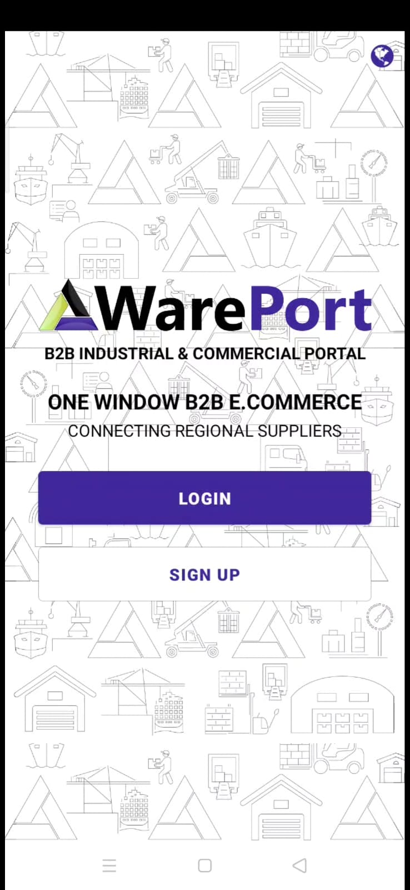
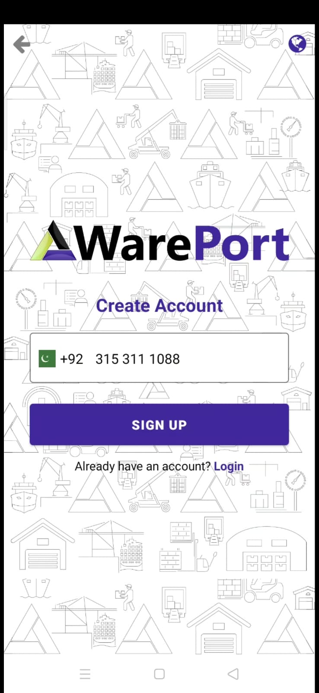
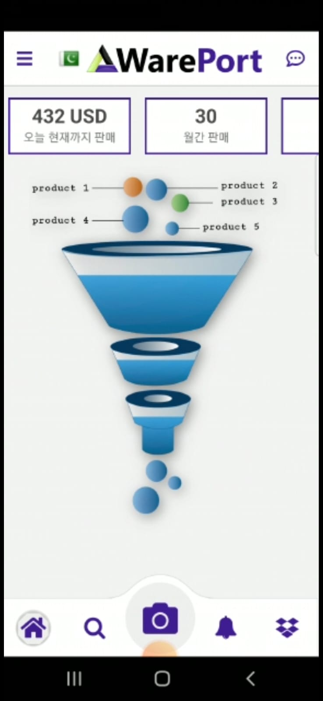
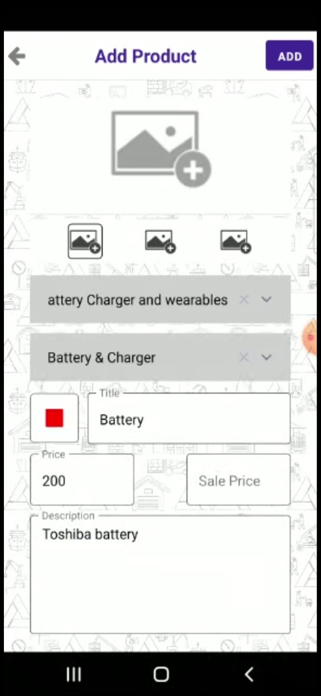

# Wareport - B2B Supplier Connection Solution (Frontend React Native)

Wareport is a B2B solution designed to connect regional suppliers seamlessly. Built using React Native for the frontend and Node.js for the backend, Wareport streamlines the procurement process, making it efficient and convenient for businesses.

## Features

- **Supplier Connection:** Easily connect with regional suppliers through the Wareport platform.
  
- **Simplified Procurement:** Streamline the procurement process, from browsing suppliers to placing orders, all in one platform.

- **Order Tracking:** Track orders from placement to delivery, ensuring transparency and accountability.

- **Language Support:** Choose between English and Korean language options for enhanced accessibility.

- **Profile Picture:** Add a profile picture to personalize your account and enhance user engagement.

- **Edit Account Details:** Easily update account information such as contact details, address, and preferences.

## Screenshots

